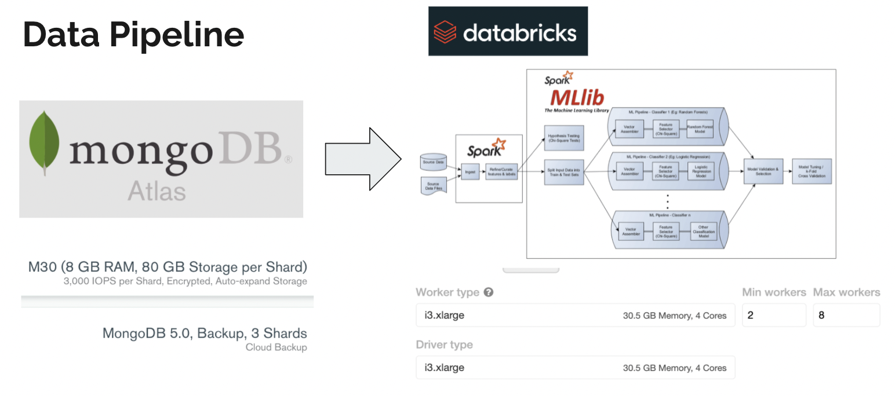

# Hospital-Expense-Prediction

## Intro

This is a project to use PySpark(Spark SQL, Spark ML) and Mongodb to build distributed machine learning prediction on New York Hospital Expenses in patient level. There are three targests we consider in total: Length of Stay, Cost, Charges and Copayment Proportion. Our team members are  *Wei He*(whe13@usfca.edu), *Kaihang Zhao*(kzhao24@usfca.edu), *Jih-Chin Chen*(jchen217@usfca.edu), *Tong Wang*(twang77@usfca.edu) and *Yangzhou Tang*(ytang47@usfca.edu).

 In this project, we created **MongoDB Atlas** and sharded the data into three clusters to improve data management. Then we created a data pipeline to access **20GB+** of raw data from **AWS S3** and transferred the cleaned data to MongoDB Atlas. After performing data preprocessing, we loaded data from MongoDB Atlas and applied machine learning algorithms in a distributed system on **Databricks** using **Spark ML**.

## Data Preprocessing

## ML Prediction Target
